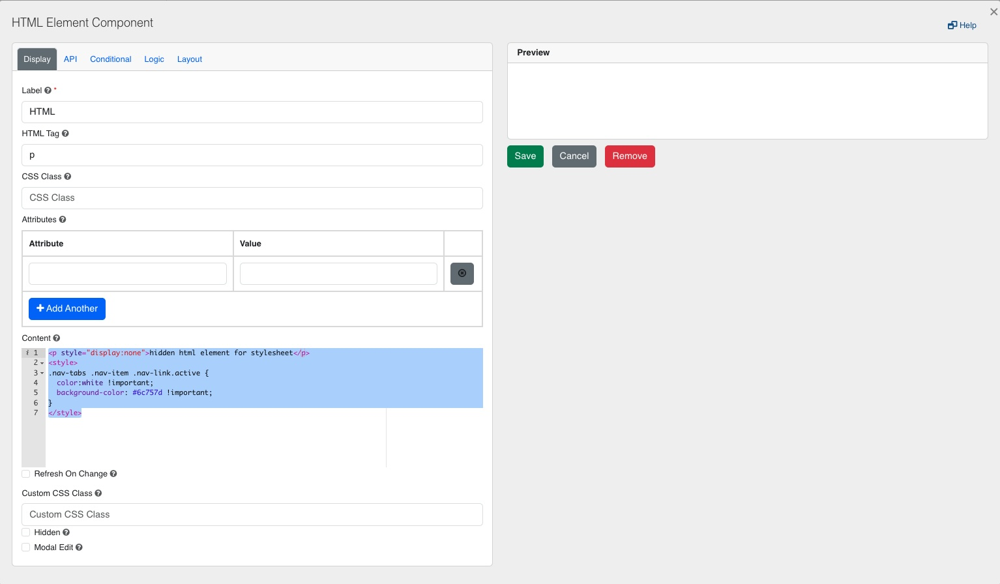
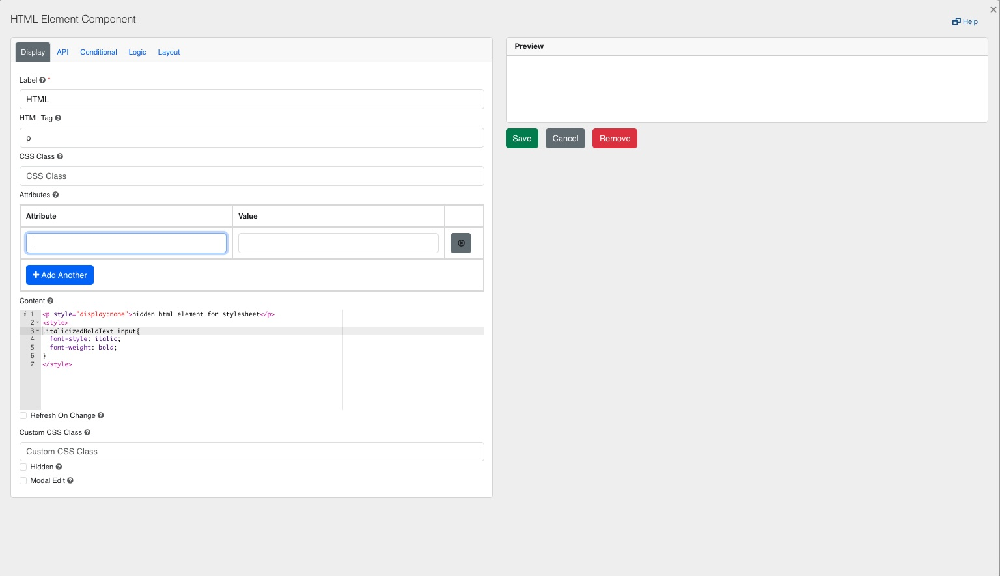
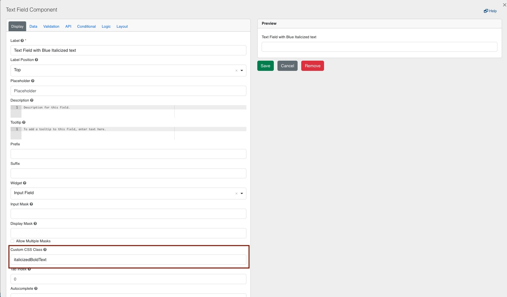

[Home](index) > [Components](Components) > [Custom](Custom) > **Styles**
***

## Working Examples

> Try a working example 
> [View example](https://submit.digital.gov.bc.ca/app/form/submit?f=1a795260-d9b5-44dd-89a8-52d769284df2)

> Download this example file and [import](Importing-and-exporting-form-designs) it into your design 
> [example_styles_schema.json](../examples/example_styles_schema.json){:download="example_styles_schema.json"}
***

## Styles (Tutorial)

Create visually pleasing designs with built-in formatting styles using our version of [Bootstrap](https://getbootstrap.com/docs/4.5/components/).

<!-- **On this page:**

* [Styles(Tutorial)](#Styles(Tutorial))
   * [Components](#Components)
   * [Utilities](#Utilities)
   * [Columns](#Columns)
   * [Icons](#Icons)
     * [Button icons](#Button-icons)
     * [Input icons or text](#Input-icons-or-text) -->

## Styles(Tutorial)

### Components
[Bootstrap Components](https://getbootstrap.com/docs/4.5/components/) can be added using the `Layout > HTML Element` in Advanced Fields. Copy and paste components from the examples on the Bootstrap site. There are also a few samples implemented here in the working example.

You can either paste examples directly into the `content` field or into the `HTML Tag` and `CSS Class` fields like this:

You'll find some components built into simple and advanced fields like Panel. Other options are also available in components like adding prefix and suffix to input groups.

### Utilities
<!-- **[Back to top](#top)** -->

Experiment with [Bootstrap Utilities](https://getbootstrap.com/docs/4.0/utilities/) to add custom styles to your form.

### Columns
<!-- **[Back to top](#top)** -->

Use [Bootstrap Grids](https://getbootstrap.com/docs/4.0/layout/grid/) to customize columns. A form is 12 columns wide, divide it up any way you like (6x2, 4x3, 10+2, etc). There are some pre-set column widths in Simple Fields. In Advanced Fields, here's an example of 4 columns of width 3 (4 X 3 = 12):

You can also nest columns, that is to say put columns inside of other components like a panel or even another parent column component.

### Icons
<!-- **[Back to top](#top)** -->

Add icons to buttons and input fields from [Font Awesome](https://fontawesome.com/v4.7.0/icons/).

#### Button Icons

Example, enter “fa fa-plus” in one of the button icon fields.

#### Input Icons or Text
You can add an input icon in front of a field by adding an HTML tag into the “Prefix” field. <I class=”fa fa-phone”></i>.

#### Defining Custom CSS
Certain requirements need customizing the form's appearance beyond the capabilities of standard form components. To achieve this, users can integrate custom CSS into the form by defining a CSS class within the HTML Element component and subsequently referencing this class in other advanced components.

While making these changes, please refer to [Design Guidelines for the B.C. Visual Identity Program](https://www2.gov.bc.ca/gov/content/governments/services-for-government/policies-procedures/bc-visual-identity/design-guidelines#stationery)  

By default CHEFS implements  [bootstrap compoonent CSS.](https://getbootstrap.com/docs/4.6/getting-started/introduction/) You can override these CSS classes by creating a more specific CSS rule in Html Element compoenent. Following example overrides .nav-tabs properties to make active tab background from white to grey, this will be applied to all the tabs component across the form. You can also use the !important declaration to give a CSS rule more weight, making it override other conflicting styles. However, it's generally recommended to use this approach sparingly as it can make your CSS harder to maintain and troubleshoot.

To apply styles to specific components, you can define a custom CSS class. For instance, if you wish to italicize and bolden the text within an input field, you can achieve this by incorporating the following CSS code into the HTML Element component. Then, reference this class within the input text field component, as illustrated in the screenshots below.

***
[Terms of Use](Terms-of-Use) | [Privacy](Privacy) | [Security](Security) | [Service Agreement](Service-Agreement) | [Accessibility](Accessibility)